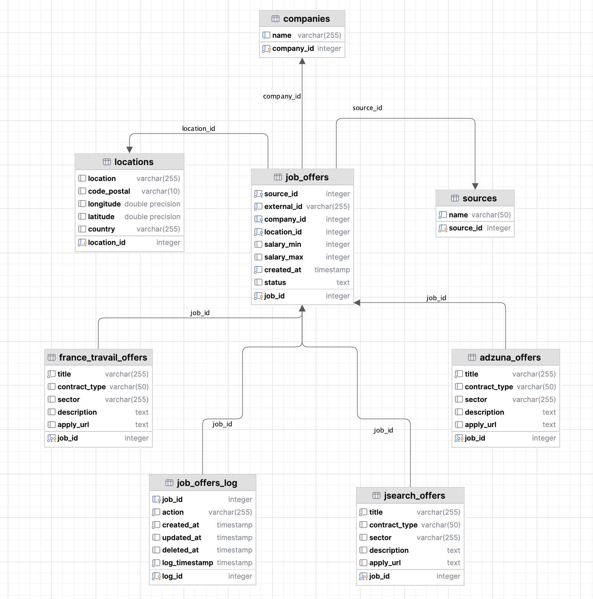

<div style="text-align:center">


</div>

<div style="text-align:center">
  
</div>

# Job Market

Centralisation et recommandation d’offres d’emploi multicanal.

Ce projet vise à agréger, nettoyer et proposer des offres d’emploi issues de plusieurs sources externes (France Travail, Adzuna, JSearch) et à les exposer via une API de recherche/recommandation performante, utilisable en usage interne ou pour prototypage de projets data RH.

## Sommaire

- [Présentation](#présentation)
- [Architecture générale](#architecture-générale)
- [Prérequis](#prérequis)
- [Installation & Exécution](#installation--exécution)
  - [Installation des prérequis](#installation-des-prérequis)
- [Récupération des accès](#récupération-des-accès)
- [Configuration et variables d'environnement](#configuration-et-variables-denvironnement)
- [Permissions et fichiers critiques](#permissions-et-fichiers-critiques)
- [Aperçu rapide de la base de données](#aperçu-rapide-de-la-base-de-données)
  - [Relations principales](#relations-principales)
  - [Diagramme](#diagramme)
- [Lancement](#lancement)
    - [Première exécution manuelle](#première-exécution-manuelle)
    - [Lancer Docker Compose](#lancer-docker-compose)
    - [Airflow](#airflow)
- [Pipeline ETL](#pipeline-etl)
    - [1. Extraction](#1-extraction)
    - [2. Transformation et normalisation](#2-transformation-et-normalisation)
    - [3. Chargement](#3-chargement)
- [Orchestration dans Airflow](#orchestration-dans-airflow)
- [API Job Market – Concepts et Fonctionnement](#api-job-market--concepts-et-fonctionnement)
    - [Concepts clés](#concepts-clés)
    - [Principaux endpoints](#principaux-endpoints)
- [Moteur de recommandation](#moteur-de-recommandation)
- [Streamlit](#streamlit)
- [Frontend Experience](#frontend-experience)
- [Grafana](#grafana)
  - [Configuration](#configuration)
  - [Importation du dashboard](#importation-du-dashboard)
- [Ressources et dictionnaires](#ressources-et-dictionnaires)
- [Auteurs](#auteurs)

---

## Présentation

Job Market est une plateforme complète permettant de :

* Collecter des offres d'emploi via plusieurs _**APIs**_ (France Travail, Adzuna, JSearch)
* Nettoyer, enrichir et structurer les données via un pipeline _**ETL**_
* Proposer un moteur de recommandation via une API _**FastAPI**_ performante
* Visualiser les résultats via une interface _**Streamlit**_
* Orchestrer le tout avec _**Apache Airflow**_, et _**Docker Compose**_

---

## Architecture générale

* ETL Python : Extraction → Transformation → Chargement (optionnel en PostgreSQL)
* API FastAPI : Endpoints de recherche et consultation d’entreprises
* Interface Streamlit : Simulation d’un site d’emploi
* Base PostgreSQL : Stockage relationnel optimisé (triggers, vues)
* Orchestration Airflow : Déclenchement des flux via DAGs
* Docker : Conteneurisation et configuration complète avec docker-compose
* Monitoring (optionnel) : Intégration possible avec Prometheus & Grafana

<div style="text-align:center">


</div>

---

## Prérequis

* Python 3.10 ou supérieur (recommandé)
* Docker & Docker Compose
* Homebrew
* Git
* Ports exposés :
  * API: ```8000```
  * Streamlit: ```8501```
  * Airflow Webserver: ```8080```

> Toute instance locale utilisant déjà l'un de ces ports devra être arrêtée, 
> ou alors les ports devront être modifiés afin d’éviter les conflits.
>>La modification peut se faire directement dans le docker-compose.yaml
---


## Installation & Exécution
### Installation des prérequis

### **Homebrew (macOS / Linux)**
Homebrew est un gestionnaire de paquets indispensable pour installer facilement
des outils comme git, python, ou docker.
```bash
brew --version
```
Installation (si non installé) :

```bash
/bin/bash -c \"$(curl -fsSL https://raw.githubusercontent.com/Homebrew/install/HEAD/install.sh)\"
```

Une fois installé, ajouter Homebrew au PATH (si ce n’est pas fait automatiquement) :

#### **macOS (zsh) :**
```bash
echo 'eval \"$(/opt/homebrew/bin/brew shellenv)\"' >> ~/.zprofile
eval \"$(/opt/homebrew/bin/brew shellenv)\"
```

### Installation de Git
Git doit être installé pour récupérer le dépôt du projet :

```bash
git --version
```
Si Git n'est pas installé, sur macOS (Homebrew) :
```bash
brew install git
```

#### **Debian/Ubuntu :**

```bash
sudo apt install git
```

#### **Sur Windows :**
👉 [Télécharger Git pour Windows](https://git-scm.com/downloads/win)

### Installation de python

Installation rapide :

#### **macOS (Homebrew) :**

```bash
brew install python
```

#### **Debian/Ubuntu :**

```bash
sudo apt update
sudo apt install python3 python3-venv python3-pip
```

#### **Windows :**
👉 [Télécharger Python (>= 3.10) de préférence 3.12](https://www.python.org/downloads/windows/)

> ⚠️ Important : S'assurer que Python est bien ajouté au PATH (option d'installation par défaut recommandée).

#### Une fois tous ces prérequis sont installés, on peut récupérer le projet et procéder au lancement :

1. Cloner le dépôt
```bash
git clone <https://github.com/DarkByte-XI/Job-Market.git>
cd Job_Market
```

2. Créer et activer un environnement virtuel :
```bash
python -m venv .venv
source .venv/bin/activate  # Linux/Mac
.venv\Scripts\activate     # Windows
```
> 🔍 Sur Pycharm, créer un projet crée l'environnement virtuel automatiquement.

3. Installer les dépendances :
```bash
pip install -r requirements.txt
```

---

## Récupération des accès

Pour récupérer les accès des API, il est nécessaire de créer un compte sur chacun des sites suivants :
* https://developer.adzuna.com/
  * Les accès sont disponibles dans **Dashboard > API Access Details**
* https://francetravail.io/
  * Créer une application et récupérer les accès
* https://rapidapi.com/
  * Pour accéder aux accès de Jsearch une fois le compte créé :
  1. https://rapidapi.com/letscrape-6bRBa3QguO5/api/jsearch
  2. Cliquer sur `Job Search` dans `Endpoints` à gauche de l'écran
  3. L'`url`, `x-rapidapi-key` et `x-rapidapi-host` sont disponibles dans le code snippets à droite de l'écran.

--- 

## Configuration et variables d'environnement

Pour sécuriser et centraliser la configuration sensible (identifiants d’API, clés secrètes, etc.), le projet utilise un fichier `.env` **non versionné**.

- Un modèle de configuration est fourni :  
  **`.env_copy`**  
  > Ce fichier contient toutes les variables attendues, mais sans valeur (ou avec des valeurs d’exemple).
Cette partie est importante pour initier les connexions avec les 
API et se connecter à la base de données
### Utilisation

1. **Copier le modèle** dans à la racine :
    ```bash
    cp .env_copy .env
    ```

2. **Complèter** le fichier `.env` avec ses propres identifiants :
    - Clés d’API pour France Travail, Adzuna, JSearch, etc.
    - Les accès pour Grafana (au choix)
    - Les accès des bases de données (au choix)
    - Générer FERNET_KEY (Airflow) :
    ```bash
    python -c "from cryptography.fernet import Fernet; print(Fernet.generate_key().decode())"
    ```
    - Générer INTERNAL_API_SECRET_KEY (Airflow) :
    ```bash
   openssl rand -hex 16
    ``` 

> Certaines valeurs sont pré-remplies dans `.env`. 
>> ⚠️Ne pas changer le nom des variables d'environnements !

3. **Ne jamais partager son fichier `.env`**  
   Il contient des informations confidentielles (identifiants personnels, tokens…).

### Bonnes pratiques

- Le fichier `.env` est ignoré par Git grâce à `.gitignore`.
- Ne jamais commiter de clés réelles dans le repo !
- Les variables d'environnement sont injectées dans les environnements des services dans le docker-compose,
toute modification peut générer des erreurs. À modifier uniquement en cas de nécessité et de connaissance de l'environnement.

---

## Permissions et fichiers critiques

Avant tout lancement (notamment sous Linux/macOS), il faut s'assurer que :

* `entrypoint.sh` est exécutable pour exécuter automatiquement les fichiers `.sql` :

```bash
chmod +x ./src/sql/entrypoint.sh
````
* Assurer les droits d'écriture pour Airflow et services associés
```bash
chmod -R u+rwX dags logs plugins data
```

* Si nécessaire, appliquer les droits pour Docker
```bash
chmod -R u+rwX ./src
```
---

## Aperçu rapide de la base de données

La base de données est modélisée selon une approche en étoile pour optimiser l’intégration et la consultation d’offres d’emploi issues de plusieurs sources (Adzuna, France Travail, JSearch).
Voici les principaux composants du modèle :

* **job_offers** : table centrale qui référence toutes les offres, leur statut (active/inactive), la date d’insertion, et les clés étrangères associées.
* **companies** : contient les informations normalisées des entreprises (nom, SIRET...).
* **locations** : centralise les lieux géographiques (ville, code postal...).
* **sources** : identifie l’origine des offres (API/source partenaire).
* **Tables de faits par source** : chaque source (**adzuna_offers**, **france_travail_offers**, **jsearch_offers**) 
contient les détails spécifiques à l’offre d’emploi, comme le titre, la description, le salaire, et est liée à la table job_offers via une clé étrangère (job_id).

### Relations principales

Chaque offre d’emploi (job_offers) est liée à :
* Une entreprise (companies)
* Un lieu (locations)
* Une source (sources)
* Un détail source (table *_offers correspondante via job_id)

Ce modèle garantit une structuration propre, la déduplication des entités (entreprises, lieux) et 
facilite les requêtes analytiques avancées (par ville, entreprise, statut, etc.).

### Diagramme

<p style="text-align:center">



</p>

---


## Lancement

### Première exécution manuelle
Avant de lancer l’API pour la toute première fois, il est nécessaire d'exécuter le pipeline 
ETL au moins une fois pour alimenter la base de données et rendre l'API fonctionnelle.

Depuis la racine du projet, exécuter :

```bash
PYTHONPATH=src python ./src/pipelines/main.py
```

Cette commande va :

* Extraire les données initiales via les APIs externes (France Travail, Adzuna, JSearch).
* Transformer et normaliser ces données.
* Charger les données enrichies en base ou en JSON.
* Rendre l'application web Streamlit exploitable

> ⚠️ Sans cette étape initiale, l’API démarrera sans données exploitables.


### **Lancer Docker Compose**
```bash
docker-compose up --build
```
> ⚠️ Avant de lancer le projet, Docker doit être installé sur votre machine.
> Voici les deux approches principales, adaptées à tous les profils (débutant comme avancé).

_**Option 1**_ : Docker Desktop (recommandé, tout-en-un)
Docker Desktop embarque à la fois l’interface graphique, le moteur Docker, Docker Compose, ainsi que tous les outils CLI nécessaires (Windows, macOS, Linux).

Télécharger Docker Desktop
👉 https://www.docker.com/products/docker-desktop/

Suivez les instructions d’installation, puis lancez l’application.

Ouvrez un terminal et vérifiez la disponibilité :
```bash
docker --version
docker compose version
```

> Remarque : Sous Linux, Docker Desktop n’est plus obligatoire depuis 2022, 
> mais il offre une expérience unifiée.

_**Option 2**_ : Installation CLI uniquement (pour utilisateurs avancés)
Sous macOS (Homebrew)
```bash
brew install --cask docker       # Installe Docker Desktop (GUI et CLI)
# ou pour installer uniquement le CLI Docker :
brew install docker docker-compose
```
> Pour utiliser Docker Desktop, lancez-le depuis le dossier Applications.

_**Sous Linux**_
Utilisez le script officiel d’installation (compatible Ubuntu, Debian, Fedora, etc.) :

```bash
curl -fsSL https://get.docker.com | sudo sh
sudo usermod -aG docker $USER  # Ajoute votre utilisateur au groupe docker
```
Déconnexion puis reconnexion pour appliquer les droits.
Une fois Docker installé, il faut relancer le build pour que tous les services soient disponibles.

### Airflow

Le projet embarque les services Apache Airflow conteneurisés. Ils permettent de planifier les flux ETL de manière robuste et
les exécuter de manière fiable.
Les services airflow permettent de :
* Créer les dépendances nécessaires et les répertoires essentiels (./airflow/{dags, logs, plugins})
* Initialiser la DB Airflow avec PostgreSQL
* Créer les utilisateurs par défaut (admin:admin)
> Les accès à l'interface de Airflow sont disponibles dans les logs du service
> airflow-apiserver. Pour y accéder dans l'application Docker, **containers > airflow-apiserver > Logs**.
> Sinon dans le terminal de l'environnement, à la racine, écrire la commande suivante :
```bash
docker logs job_market-airflow-apiserver-1 2>&1 | grep -m 1 "Simple auth manager | Password for user 'admin':"
```
```bash
Sortie attendue :
Simple auth manager | Password for user 'admin': random_key
```
* Initialiser l'apiserver permettant d'accéder à l'interface utilisateur
* Initialiser le dag processor permettant de traiter les dag et les loguer dans la base de données airflow.
* Initialiser le triggerer permettant de déclencher le dag principale : **etl.py** dans ./airflow/dags
* Initialiser le scheduler permettant de planifier le dag.

### Accès à l’interface Airflow :
> http://localhost:8080

---

## Pipeline ETL

### 1. Extraction
Les modules dans ./src/fetch_functions/ définissent les fonctions d'extraction.
Les modules dans src/pipelines/extract.py appellent ces fonctions et orchestrent l'extraction
ainsi que la sauvegarde des sorties dans ./data/raw_data/{source}/.json

### 2. Transformation et normalisation
Le module ./src/pipelines/transform.py :
- Nettoie les données (accents, minuscules, valeurs parasites, etc)
- Normalise les valeurs
- Harmonise la structure des données
- Sauvegarde les données traitées dans ./data/processed_data/*.json

### 3. Chargement
Le module ./src/pipelines/load.py :
- Récupère le dernier fichier transformé dans ./data/processed_data/
- Établie une connexion avec la base de données lancée dans le docker-compose
- Charge les données via un processus ThreadPoolExecutor
---

## Orchestration dans Airflow
Le pipeline ETL est orchestré via un dag qui se trouve dans le répertoire ./airflow/dags.
Le workflow consiste à déclencher en parallèle l'extraction des données des différentes sources puis transformer
et alimenter la base de données. Il permet également de mettre à jour l'API via un rechargement du
dernier fichier extrait.

<div style="text-align:center">


</div>

---


## API Job Market – Concepts et Fonctionnement

L’API centrale du projet Job Market expose l’ensemble des offres d’emploi agrégées, enrichies et recommandées grâce à un moteur intelligent.
Pensée pour la performance et la simplicité d’intégration, elle pré-charge au démarrage tous les fichiers nécessaires : 
cela permet de vectoriser l’ensemble des offres en mémoire (TF-IDF, similarité cosinus) afin de garantir des réponses rapides, 
sans latence liée au rechargement ou au parsing de gros fichiers à chaque requête.

**Pour consulter la documentation interactive complète :**
http://localhost:8000/docs

### Concepts clés

* **Vectorisation en mémoire** :
Toutes les offres sont transformées en vecteurs dès le démarrage (TF-IDF), ce qui permet d’appliquer en temps réel des calculs de similarité (cosinus) 
entre une requête utilisateur et l’ensemble du corpus.

* **Traitement asynchrone et réactif** :
L’API expose des endpoints pensés pour la recherche en temps réel, la récupération massive ou paginée, et la synchronisation avec le pipeline ETL.

* **Rechargement à chaud des données** :
Un endpoint dédié permet d’actualiser l’index en mémoire dès qu’un nouveau fichier de données est extrait/transformé, sans redémarrage de l’API.

### Principaux endpoints
#### 1. /search

Recherche d’offres recommandées selon une requête utilisateur (mot-clé, poste, compétences…).
Le moteur renvoie les offres les plus pertinentes sur la base du score de similarité, sans latence de chargement.


**Requête** :
```bash
curl -X GET http://localhost:8000/search?query=data%20engineer
```

**Réponse** : 

Liste d’offres recommandées (jusqu’à 150 résultats), structurées selon les principaux champs :
`external_id`, `title`, `company`, `location`, `code_postal`, `salary_min`, `salary_max`, `url`

```json
[
  {
    "external_id": "5121612668",
    "title": "data engineer hf en alternance",
    "company": "openclassrooms",
    "location": "annecy",
    "code_postal": "74000",
    "salary_min": null,
    "salary_max": null,
    "url": "https://www.adzuna.fr/land/ad/5121612668?..."
  }
]
```

#### 2. /companies
Récupère la liste unique des entreprises présentes dans les offres disponibles.

**Requête**:
```bash
curl -X GET http://localhost:8000/companies
```

**Réponse** :

Liste structurée d’entreprises :
`id`, `name`, `sector

```json
[
  {
    "id": "a9f5bb1c9c6e0e9b...",
    "name": "openclassrooms",
    "sector": "education"
  }
]
```
#### 3. /reload

Permet de recharger dynamiquement l’index en mémoire à partir des nouveaux fichiers extraits par le pipeline ETL.
Intégré dans le workflow, il assure une actualisation instantanée après chaque update du pipeline.

**Exécution manuelle** :

```bash
curl -X POST http://localhost:8000/reload
```

#### 4. /jobs

Endpoint permettant la récupération paginée de l’intégralité des offres présentes dans la base, 
pour affichage ou exploration front-end.

#### **Remarque** :
Tous les endpoints sont conçus pour l’intégration directe avec des frontends web, outils de data visualisation, ou automatisations backend.
Le moteur de recherche, basé sur la vectorisation et la recherche par similarité, garantit des recommandations pertinentes et un temps de réponse optimal, même sur un large volume d’offres.

---

## Moteur de recommandation
Défini dans le module recommender.py dans ./src/recommender, il traite le fichier de données
transformé à la suite du pipeline ETL pour afficher une sortie intelligente des offres.
Son mode d'opération dépend de la vectorisation des données et explicitement de la méthode de pondération
**TF-IDF** souvent utilisée dans la recherche d'informations.
Les résultats sont finalement affichés grâce à un coéfficient défini par la **similarité cosinus**.
Finalement, les poids de pondération ainsi que le seuil de similarité sont définis dans les fonctions de recommandation.

---

## Streamlit
Grâce à streamlit qui permet la création d'applications web, une interface visuelle pour l'accès
aux données de l'API a été configurée, permettant ainsi de profiter de la fonctionnalité de recherche de manière
interactive.
Streamlit est lancée via docker compose en même temps que les autres services et est disponible
à l'adresse suivante 👉http://localhost:8501

--- 

## Frontend Experience
Cette partie non inclue dans le code source et developpée dans un repo séparé avec Node.js et React, met en avant la vision produit issue du backend
et traite en grande partie le job-listing, le moteur de recommandation des offres d'emploi ainsi que les filtres intégrés dans les différents endpoints de l'API.

<p style="text-align:center">
  
https://github.com/user-attachments/assets/f1a67f85-b652-4989-a797-93fafea70a6a

</p>


## Grafana
Grafana est une plateforme de représentation graphique de données statistiques open source.
Il est embarqué dans les services docker du projet.
Il est disponible à l'adresse suivante 👉 http://localhost:3000

Pour se connecter, il faut récupérer les accès définis à partir de `.env`.

### Configuration
Une fois à l'adresse mentionnée ci-dessus, les identifiants d'accès se trouvent dans le fichier .env.
Pour créer un dashboard, il faut d'abord établir une connexion avec la base de données postgres, alimentée par les
offres d'emploi.
1. Aller à l'adresse http://localhost:3000/connections/datasources/new
2. Rechercher PostgreSQL dans la barre de recherche et séléctionner.
3. Nommer la connexion ou laisser par défaut.
4. Dans la partie connexion, la valeur par défaut de l'hôte est **localhost:5432**.
5. Fournir le nom de la base de données, ici **jobs_db**
6. Fournir l'username et le mot de passe, défini dans `.env`.
7. Désactiver TLS/SSL et choisir la version 15 de PostgreSQL (similaire à celle lancée dans docker).
8. Sauvegarder et tester la connexion
> Si la connexion échoue, vérifier que le host, username et mot de passe sont bons.

### Importation du dashboard
À la racine, un fichier JSON, nommé `grafana_default_dashboard.json`, permet d'importer
un dashboard déjà configuré. Il est possible aussi de créer un dashboard vierge une fois la connexion avec
la base de donnée est établie. Des connaissances en SQL sont nécéssaires pour créer les visualisations.

Pour importer le dashboard :
1. Aller sur http://localhost:3000/dashboards/
2. Cliquer sur `New` ou `Nouveau`
3. `Import` ou `Importer`
4. Copier et coller le contenu du fichier json dans l'espace dédié et `charger`.

Le contenu du dashboard, une fois enrichi, est le suivant :

<p style="text-align:center">


</p>

---

## Ressources et dictionnaires
### Dossier ressources/ :
- **appellations_code.json** : Codes métiers France Travail, essentiel aux requêtes d'extraction.
- **data_appellations.json** : Appariement codes/intitulés pour métiers "data".
- **appellations_hightech.json** : Appariement codes/intitulés pour métiers de la tech.
- **job_keywords.json** : Mots-clés pour recherches Adzuna et JSearch. 
- **code_pays.json, communes_cp.csv** : fichiers d'enrichissement des localisations.

---

## Auteurs

Projet personnel développé et maintenu par [Dani CHMEIS]() & [Enzo Petrelluzi]().


